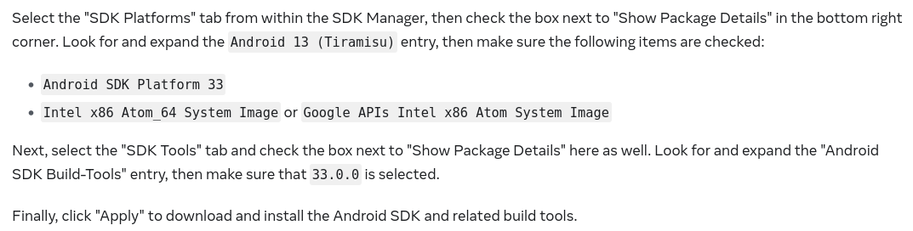

# mahamimobile

### Getting started developing

- Install node 18+ and pnpm (faster version of npm)
- Install Android Studio
- Install required SDK components: 
- `pnpm install` (or `pnpm i` for short)
- `pnpm start` to start the dev server
- Press A to open the app on the device or emulator